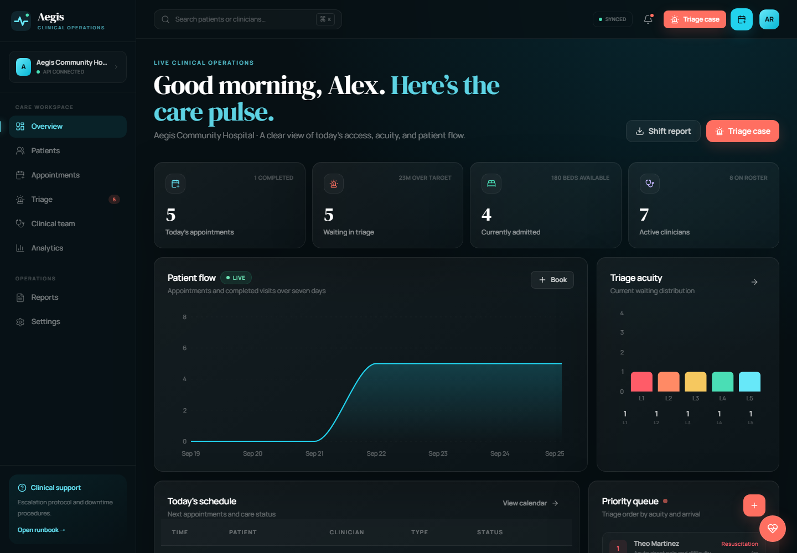
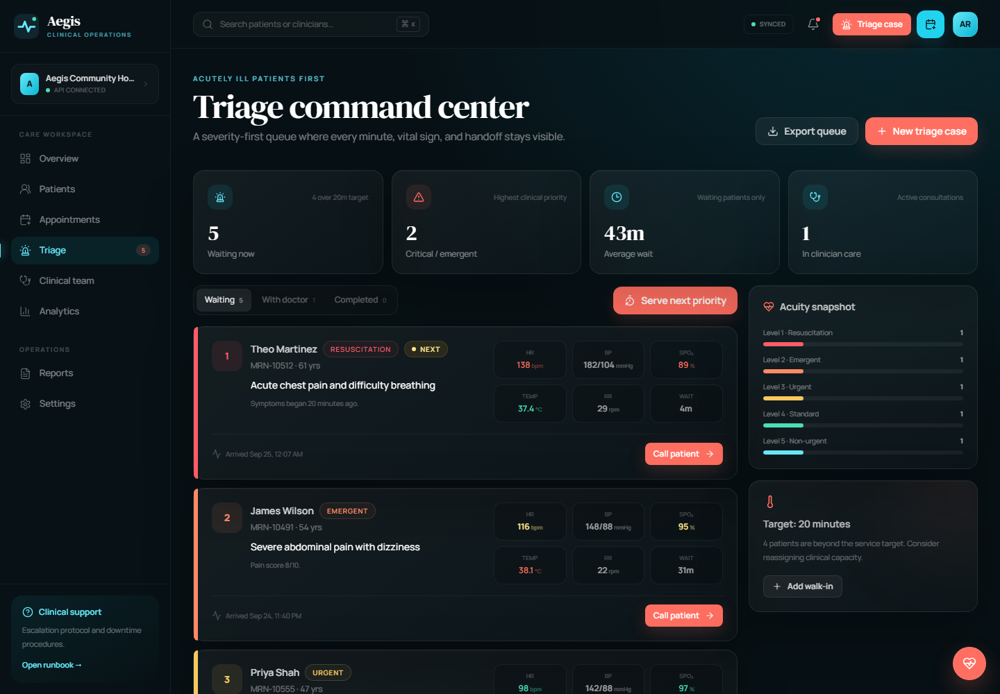
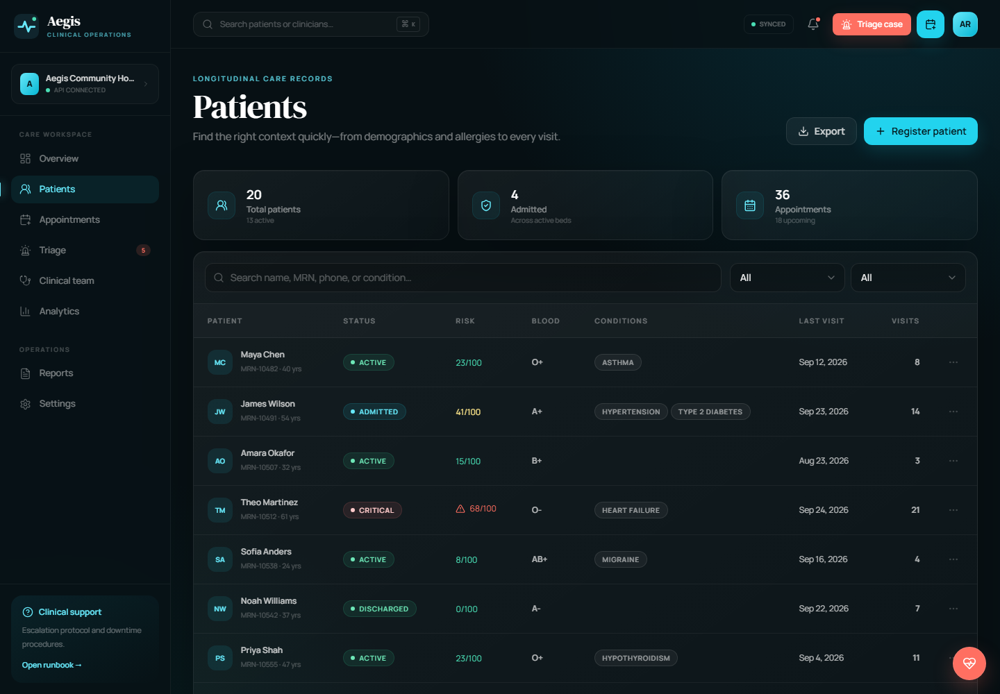

<div align="center">


<h1>Aegis Health</h1>
<h3>Every patient seen. Every priority understood.</h3>

<p>
A complete hospital management workspace for patient records, appointments, clinician schedules, severity-first triage, operational analytics, and clinical reporting.
</p>

<p>
  <a href="#quick-start"></a>
  <a href="https://github.com/812021664/Hospital-Management-System" target="_blank" rel="noopener noreferrer"></a>
</p>

<p>
  <a href="https://github.com/812021664/Hospital-Management-System/stargazers"></a>
  <a href="https://github.com/812021664/Hospital-Management-System/network/members"></a>
  
  
  
  
</p>

</div>

---

## Clinical command center



Aegis brings the day’s access, acuity, capacity, and handoff signals into one calm operational view. The interface remains responsive, keyboard-friendly, and usable when the backend is unavailable.

## What changed from the original repository

The original project was a Python console application built around five classic data structures. Those algorithms remain part of the product and are now exposed through a complete web system.

| Original capability | Upgraded Aegis implementation |
| :--- | :--- |
| Circular routine queue | Appointment scheduling, status transitions, capacity checks, and operational calendar |
| Min-heap emergency triage | Severity-first clinical queue with vitals, wait targets, assignment, and handoff |
| Singly linked doctor schedules | Weekly clinician roster, department utilization, and appointment capacity |
| Hash-table patient index | Searchable longitudinal patient CRM with demographics, conditions, allergies, and risk |
| Undo stack | Safe reversible core operations with exact severity and queue restoration |
| Per-doctor and served/pending reports | Hospital analytics, acuity snapshots, visit outcomes, and CSV/JSON/PDF exports |
| Console interaction | Responsive React clinical workspace |
| In-memory state | Validated FastAPI service with persistent workspace storage and local browser fallback |

## Product modules

### Triage command center

- Five emergency severity levels with FIFO tie-breaking
- Live wait-time calculations and configurable service targets
- Heart rate, blood pressure, SpO₂, temperature, and respiratory rate
- Priority “serve next” workflow and clinician assignment
- Critical and emergent escalation styling
- Walk-in creation, encounter completion, and queue export



### Patient records

- Search by name, MRN, phone, or medical condition
- Demographics, insurance, blood group, allergies, and conditions
- Risk score, visit history, triage history, and insurance context
- Patient registration with server-side-compatible validation
- Privacy-aware CSV export



### Appointment operations

- Seven-day scheduling strip and detailed daily calendar
- Clinician and visit-type filters
- Conflict-safe booking
- Check-in, consultation start, completion, and cancellation workflow
- Routine, new-patient, telehealth, emergency, and procedure visits

### Clinical team

- Specialization, department, status, rating, and experience
- Daily appointment utilization
- Weekly department schedule and capacity view
- Clinician profile and care-team coverage

### Analytics and reports

- Seven- to thirty-day patient-flow trends
- Appointment outcomes and completion rate
- Triage acuity distribution
- Department load and clinician coverage
- Patient census, appointment, triage, and handover exports
- CSV, JSON, and print/PDF workflows

## Technology

| Layer | Technology |
| :--- | :--- |
| Frontend | React 18, TypeScript, Vite, React Router |
| Interface | Tailwind CSS, Lucide icons, custom glass design system |
| State | Zustand with persisted browser fallback |
| Charts | Recharts |
| Forms and validation | React Hook Form, Zod |
| API | FastAPI, Pydantic |
| Core algorithms | Python circular queue, min-heap, linked schedules, hash index, undo stack |
| Storage | Atomic JSON persistence for the demonstration environment |
| Testing | Vitest, pytest, FastAPI TestClient |
| CI/CD | GitHub Actions, Netlify, Vercel, Docker |

## Architecture

```mermaid
flowchart LR
    USER[Clinical team] --> UI[React + TypeScript workspace]
    UI -->|Axios /api| API[FastAPI service]
    UI -. API unavailable .> LOCAL[(Browser persistence)]
    API --> DATA[(Atomic JSON workspace)]
    API --> CORE[Python hospital algorithms]
    CORE --> QUEUE[Circular queue]
    CORE --> HEAP[Min-heap triage]
    CORE --> SLOTS[Linked doctor schedules]
    CORE --> INDEX[Patient hash index]
    CORE --> UNDO[Undo stack]
```

When the API is available, Aegis imports and hydrates the workspace, then write-through workflows synchronize patients, appointments, clinicians, and triage events. If the API is unavailable, the interface switches to local persistence without blocking care operations.

## Quick start

### Requirements

- [Node.js 20+](https://nodejs.org/)
- npm 10+
- [Python 3.10+](https://www.python.org/)

### Run the complete system

```bash
git clone https://github.com/812021664/Hospital-Management-System.git
cd Hospital-Management-System
npm install
python -m pip install -r requirements.txt
npm run dev:full
```

Open **http://localhost:5173**.

The command starts FastAPI on port 8000, waits for its health endpoint, and then starts Vite.

### Frontend-only mode

```bash
npm run dev
```

The application remains fully usable with persisted browser data and an offline API indicator.

### Original Python engine

```bash
python hospital_system.py
python -m pytest -q
```

## Useful commands

| Command | Purpose |
| :--- | :--- |
| `npm run dev` | Start Vite only |
| `npm run dev:full` | Start FastAPI and the connected React app |
| `npm run api:dev` | Start FastAPI with reload |
| `npm run api:test` | Run the Python test suite |
| `npm run type-check` | Run strict TypeScript checks |
| `npm run lint` | Run ESLint |
| `npm test` | Run frontend unit tests |
| `npm run build` | Create the production frontend bundle |
| `npm audit` | Verify the npm dependency audit |

## API

Interactive API documentation is generated at:

### `http://localhost:8000/docs`

Key endpoints:

- `GET /api/status` and `GET /api/bootstrap`
- `POST /api/import`
- `GET/PUT /api/patients/{id}`
- `GET/PUT /api/doctors/{id}`
- `GET/PUT /api/appointments/{id}`
- `GET/POST /api/triage`
- `POST /api/triage/serve-next`
- `POST /api/triage/{id}/complete`
- `GET /api/legacy/reports`
- `GET /api/health`

## Repository structure

```text
src/
├── components/layout/       Shell, global search, registration workflows
├── components/ui/           Accessible reusable interface primitives
├── data/                    Realistic demonstration records
├── hooks/                   API synchronization
├── lib/                     Analytics, triage ordering, formatting, exports
├── pages/                   Eight care operations modules
├── services/                Typed FastAPI client
├── store/                   Persisted Zustand domain and interface state
└── types/                   Shared clinical domain contracts

backend/
├── app/domain/              Modernized circular queue, heap, schedules, undo
├── app/                     FastAPI models, persistence, routes
└── tests/                   API integration tests

hospital_system.py           Backward-compatible original Python engine
test_hospital_system.py      Core data-structure regression tests
complexity.md                Algorithm complexity analysis
edge_cases.md                Edge-case scenarios
sample_session.txt           Original example workflow
```

## Deployment

### Frontend

Netlify configuration is included:

```text
Build command: npm run build
Publish directory: dist
```

`public/_redirects` and `vercel.json` provide SPA history fallback.

### API

```bash
docker compose up --build
```

The API is available at `http://localhost:8000`. In production, deploy it independently and set:

```env
VITE_API_BASE_URL=https://api.example.org
```

Never place database passwords, service credentials, or private provider keys in a `VITE_*` variable. Those values are public in the browser bundle.

## Quality

```text
TypeScript ............... passed
ESLint ................... passed
Frontend unit tests ....... 4 passed
Production frontend build  passed
Python data structures ... 5 passed
FastAPI integration ...... 2 passed
npm dependency audit ...... 0 known vulnerabilities
```

## Clinical data safety

This repository is an educational and operational demonstration—not a certified EHR or medical device. Before handling real patient information, implement authenticated server-side access control, encrypted clinical storage, immutable audit logging, retention and consent policy, backups, monitoring, and required privacy and regulatory reviews.

See [`SECURITY.md`](SECURITY.md).

## Contributing

1. Fork the repository
2. Create a focused feature branch
3. Run frontend and backend checks
4. Open a pull request with clinical and technical context

---

<div align="center">
  <strong>Built for timely, equitable, human-centered care.</strong>
</div>
